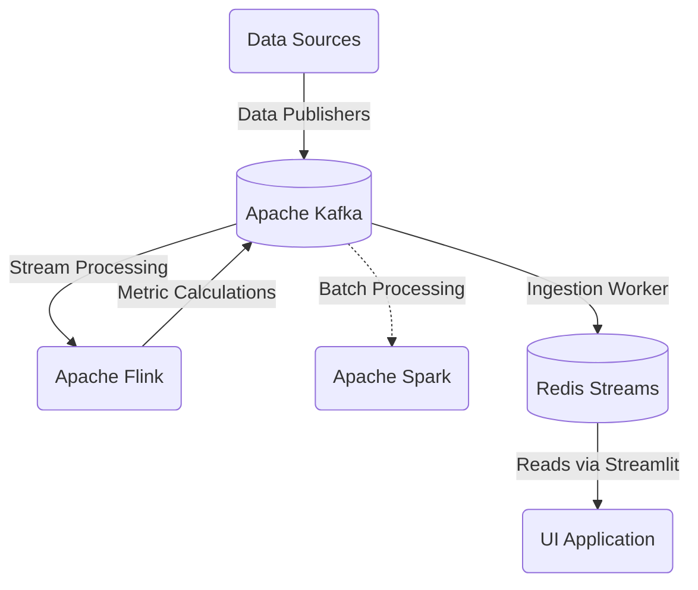

# Opus

Opus is a real-time market data streaming platform consisting of multiple data pipelines that can ingest either live or historical ticker data, serialize it using Confluent Avro via Kafka Schema Registry, and transform it into actionable financial metrics such as tumbling-window OHLC candlesticks, EMAs, and more using Apache Flink (PyFlink 2.2.0). Its modular architecture also makes it straightforward to integrate with other widely used services such as Apache Spark (PySpark 4.0.2), Redis, and more.

---

## 1. Project Overview
Opus can simulate a live stock market environment by replaying historical CSV data into Kafka. Apache Flink processes these raw events to compute financial metrics such as OHLC candlesticks and EMAs, then publishes the results back to Kafka. Downstream pipelines can persist the required data to the database of choice, such as Redis for low-latency serving. A Streamlit dashboard can then consume the Redis data to deliver an interactive, real-time view of the market. Optionally, Apache Spark can be used for batch pipelines, such as training machine learning models.

---

## 2. Architecture



---

## 3. Component Analysis

- **Market (`src/opus/market/`)**: Parses historical CSV files, serializes them using Confluent Avro via a Kafka Schema Registry, and publishes them into Kafka at variable speeds, synchronizing timestamps accurately.
- **Process (`src/opus/process/`)**: 
  - `stream/`: Uses Apache Flink to consume raw events and continuously calculate actionable financial metrics, including tumbling window OHLC candlesticks, EMA indicators, etc.
  - `batch/`: Uses Apache Spark for periodic batch processing, including machine learning and modeling on historical data.
- **Ingest (`src/opus/ingest/`)**:
  - `redis_worker.py`: A Python worker that listens to the computed Kafka metrics topics and pushes them securely into Redis streams using the `xadd` command.
- **UI (`src/opus/ui/`)**: A Streamlit dashboard that connects directly to Redis to visualize the latest financial indicators seamlessly.

---

## 4. Prerequisites
- **Docker & Docker Compose**: For running Kafka, Kafka Schema Registry, Flink, Redis, and Spark.
- **uv**: Ultrafast Python package installer and resolver.
- **Java 17**: Required natively for submitting PySpark jobs

---

## 5. Quick Start

### 1. Boot Infrastructure
```bash
docker-compose up -d
```

### 2. Publish Market Data
```bash
opus market publish <TICKER> --start <START_DATE> --end <END_DATE> --speed <MULTIPLIER>
```

### 3. Start Stream Processing
```bash
opus process stream --create-topics
```

### 4. Start Ingestion Worker (Kafka -> Redis)
```bash
opus ingest redis
```

### 5. Launch Dashboard
```bash
opus ui app
```

### 6. Run Batch/ML Job (Optional)
```bash
opus process batch
```

---

## An Example: Running the Pipeline

Before executing commands, synchronize your Python environment using `uv`:
```bash
uv sync
```

### Step 1: Publishing Historical Data
Start the publisher to ingest the `.csv.gz` files from the `data/` directory. It parses nanosecond-precision timestamps, serializes the rows to Avro, and strictly orders the events chronologically into the `market` Kafka topic.

```bash
uv run opus market publish AAPL --start 20181101 --end 20181105 --speed 1.0
```
*(You can adjust the speed multiplier to playback the historical data faster or slower than real-time).*

### Step 2: Processing the Stream with PyFlink
While the publisher is streaming data to the `market` topic, launch the PyFlink streaming process in another terminal. 

This job computes aggregated metrics continuously (e.g. 5-minute Tumbling OHLC candlesticks, Exponential Moving Averages) and sinks them into derived Kafka topics.

```bash
uv run opus process stream --create-topics
```
*Note: Flink jobs hang indefinitely by design. You will see PyFlink startup noise, but the terminal will appear "stuck" while it perpetually evaluates new records.*

### Step 3: Ingest into Redis
To ensure your newly processed metrics are populating downstream properly, start the ingestion worker to read the data from Kafka and insert it into Redis streams:

```bash
uv run opus ingest redis
```

### Step 4: Launching the Live Dashboard
Start the Streamlit dashboard.

```bash
uv run opus ui app
```

The dashboard reads from Kafka metric topics (default: `OHLC_5M`, `OHLC_5M_EMA_9`) and renders live Plotly charts per selected ticker.
By default it connects to Redis `localhost:6379` for host-based runs; if you run the dashboard inside Docker, use `redis:6379` instead.
