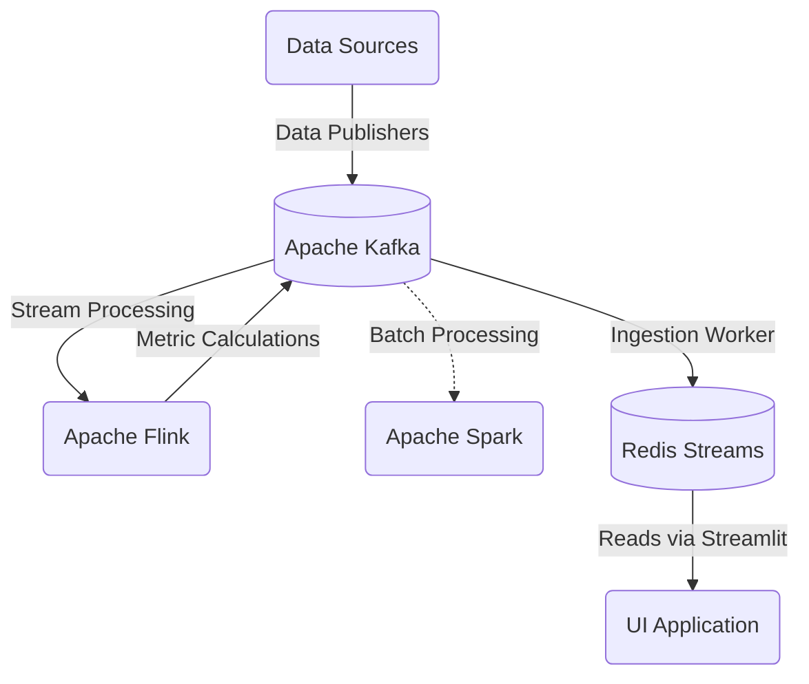

# Opus

Opus is a real-time market data streaming platform consisting of multiple data pipelines that can ingest either live or historical ticker data, serialize it using Confluent Avro via Kafka Schema Registry, and transform it into actionable financial metrics such as tumbling-window OHLC candlesticks, EMAs, and more using Apache Flink (PyFlink 2.2.0). Its modular architecture also makes it straightforward to integrate with other widely used services such as Apache Spark (PySpark 4.0.2), Redis, and more.

---

## 1. Project Overview

This project implements a real-time financial data processing pipeline that simulates live market data streaming and visualizes technical indicators on an interactive dashboard. The system replays historical stock market data as a simulated live stream and processes it using a distributed streaming architecture built on *Apache Kafka* and *Apache Flink*. Market data is ingested into Kafka, processed by a Flink streaming job to compute technical indicators such as **OHLC** (Open, High, Low, Close) and **EMA** (Exponential Moving Average), and then stored in Redis for fast retrieval by a Streamlit dashboard.

The main goal of the project is to demonstrate how modern data engineering tools can be combined to build a scalable real-time analytics pipeline. The system architecture simulates the data flow of real-world trading platforms, where market data streams are continuously processed and visualized for monitoring and analysis.

Key features include:

- Real-time streaming simulation using historical market data
- Distributed event streaming using Apache Kafka
- Stream processing and technical indicator calculation using Apache Flink
- Fast in-memory storage using Redis
- Interactive visualization through a Streamlit dashboard
                                                                                                                                                    
---

## 2. Architecture


```mermaid
flowchart TD
    A(Data Sources) -->|Data Publishers| B[(Apache Kafka)]
    B -->|Stream Processing| C(Apache Flink)
    B -.->|Batch Processing| F(Apache Spark)
    B -->|Ingestion Worker| D[(Redis Streams)]
    C -->|Metric Calculations| B
    D -->|Reads via Streamlit| E(UI Application)
```

The system follows an event-driven data pipeline centered around Apache Kafka. Historical market data is first read from local data sources and published into Kafka by a market data publisher. Kafka serves as the central message bus of the system, decoupling data producers from downstream processing and allowing multiple components to consume the same stream independently.

From Kafka, the pipeline branches into multiple processing paths.

On the streaming side, Apache Flink consumes live market events from Kafka and performs real-time metric calculations, such as OHLC aggregation and EMA computation. The processed results can then be sent back into Kafka as derived metrics, enabling continuous stream-based analytics.

On the batch side, Apache Spark can consume data from Kafka for larger-scale or offline batch processing tasks. This path is separated from the streaming worlflow because it is intended for historical analysis and non-real-time computation.

A separate ingestion worker consumes processed data from Kafka and writes it into Redis Streams. Redis acts as a fast in-memory serving layer, making the latest processed market data available with low latency.

Finally, the UI application, built with Streamlit, reads data from Redis Streams and renders the real-time dashboard. This design keeps the dashboard lightweight and responsive, since it does not need to query Kafka or perform heavy computations directly.

Overall, the architecture separates data ingestion, processing, storage, and visualization into distinct components. This modular design improves model scalability, maintainability, and flexibility, while also reflecting the structure of real-world streaming analytics systems.

---

## 3. Component Analysis

The system is organized into several components, each responsible for a different stage of the data pipeline. These modules work together to simulate a real-time financial data processing architecture.

- **Market Module(`src/opus/market/`)**: 
  - Parses historical CSV files, serializes them using Confluent Avro via a Kafka Schema Registry, and publishes them into Kafka at variable speeds, synchronizing timestamps accurately.
- **Process (`src/opus/process/`)**: 
  - `stream/`: Uses Apache Flink to consume raw events and continuously calculate actionable financial metrics, including tumbling window OHLC candlesticks, EMA indicators, etc.
  - `batch/`: Uses Apache Spark for periodic batch processing, including machine learning and modeling on historical data.
- **Ingest (`src/opus/ingest/`)**:
  - `redis_worker.py`: A Python worker that listens to the computed Kafka metrics topics and pushes them securely into Redis streams using the `xadd` command.
- **UI (`src/opus/ui/`)**: A Streamlit dashboard that connects directly to Redis to visualize the latest financial indicators seamlessly.

---

## 4. Prerequisites
- **Docker & Docker Compose**: For running Kafka, Kafka Schema Registry, Flink, Redis, and Spark.
- **uv**: Ultrafast Python package installer and resolver.
- **Java 17**: Required natively for submitting PySpark jobs

---

## 5. Quick Start

### 1. Boot Infrastructure
```bash
docker-compose up -d
```

### 2. Publish Market Data
```bash
opus market publish <TICKER> --start <START_DATE> --end <END_DATE> --speed <MULTIPLIER>
```

### 3. Start Stream Processing
```bash
opus process stream --create-topics
```

### 4. Start Ingestion Worker (Kafka -> Redis)
```bash
opus ingest redis
```

### 5. Launch Dashboard
```bash
opus ui app
```

### 6. Run Batch/ML Job (Optional)
```bash
opus process batch
```

---

## An Example: Running the Pipeline

Before executing commands, synchronize your Python environment using `uv`:
```bash
uv sync
```

### Step 1: Publishing Historical Data
Start the publisher to ingest the `.csv.gz` files from the `data/` directory. It parses nanosecond-precision timestamps, serializes the rows to Avro, and strictly orders the events chronologically into the `market` Kafka topic.

```bash
uv run opus market publish AAPL --start 20181101 --end 20181105 --speed 1.0
```
*(You can adjust the speed multiplier to playback the historical data faster or slower than real-time).*

### Step 2: Processing the Stream with PyFlink
While the publisher is streaming data to the `market` topic, launch the PyFlink streaming process in another terminal. 

This job computes aggregated metrics continuously (e.g. 5-minute Tumbling OHLC candlesticks, Exponential Moving Averages) and sinks them into derived Kafka topics.

```bash
uv run opus process stream --create-topics
```
*Note: Flink jobs hang indefinitely by design. You will see PyFlink startup noise, but the terminal will appear "stuck" while it perpetually evaluates new records.*

### Step 3: Ingest into Redis
To ensure your newly processed metrics are populating downstream properly, start the ingestion worker to read the data from Kafka and insert it into Redis streams:

```bash
uv run opus ingest redis
```

### Step 4: Launching the Live Dashboard
Start the Streamlit dashboard.

```bash
uv run opus ui app
```

The dashboard reads from Kafka metric topics (default: `OHLC_5M`, `OHLC_5M_EMA_9`) and renders live Plotly charts per selected ticker.
By default it connects to Redis `localhost:6379` for host-based runs; if you run the dashboard inside Docker, use `redis:6379` instead.

---

## 5. How to Run 
### Windows Version

This project runs as a local multi-process demo. On Windows, it is recommended to use **PowerShell** and start each long-running component in a separate terminal.

### Step 1: Start the infrastructure

Open PowerShell in the project root and run:

```bash
docker compose up -d
```
### Step 2: Confirm containers are running

In each new PowerShell window, first navigate to the project directory and activate the virtual environment:

```bash
cd your path
.\.venv\Scripts\activate
```
Once activated, the terminal prompt should show (opus).
### Step 3: Start the Flink stream processing job

Open a new PowerShell window and run:
```bash
python -m opus.cli process stream --create-topics
```
This starts the Flink job that consumes market events from Kafka and computes the downstream metrics.

Expected behavior:
- the terminal prints startup logs
- the process continues running

### Step 4: Start the Redis worker

Open a new PowerShell window and run:
```bash
python -m opus.cli ingest redis
```
This worker consumes processed Kafka topics and writes the results into Redis.

Expected behavior:
- the terminal prints startup logs
- the process continues running while waiting for incoming data

### 5. Publish Market Data
```bash
python -m opus.cli opus market publish <TICKER> --start <START_DATE> --end <END_DATE> --speed <MULTIPLIER>
```
Example
```bash
python -m opus.cli opus market publish AAPL --start 20181101 --end 20181103 --speed 50
```
This command replays local historical market data into Kafka as simulated real-time events.

In this example:
- `AAPL` is the ticker symbol
- `20181102` is the replay date
- `--speed 50` means the historical data is replayed 50 times faster than real time

### 6: Launch the dashboard
```bash
python -m opus.cli ui app
```
Expected result

If the pipeline runs successfully, the dashboard should display:

- 5-minute OHLC candlesticks
- EMA(9) and EMA(12) lines
- volume data for the selected ticker

## 7. Using Other Data 

The current demo uses a local subset of historical U.S. equities market data and replays it into Kafka as simulated real-time events. However, the pipeline is not limited to the bundled sample files. It can be adapted to other datasets as long as the input records are converted into the format expected by the stream processing job.

### Using another historical equity dataset

For trade-event style market data, the easiest approach is to keep the downstream pipeline unchanged and only replace the input data source. In practice, this means mapping the new dataset into the same market event structure used by the publisher and publishing the transformed records to the `market` Kafka topic.

At minimum, the input should provide fields equivalent to:

- `Date`
- `Timestamp`
- `EventType`
- `Ticker`
- `Price`
- `Quantity`
- `Exchange`
- `Conditions`

If the new data can be transformed into this schema, the existing Flink job, Redis worker, and Streamlit dashboard can continue to work without major changes.

### Using a different ticker

Any ticker present in the local dataset can be replayed by changing the publish command. For example:

```bush
python -m opus.cli market publish MSFT --start 20181102 --end 20181102 --speed 50
``` 
### Using real-time market data

To support real-time data, the historical publisher can be replaced with a live data publisher that continuously ingests events from an external market API, maps them to the existing `market_events` schema, and publishes them to the Kafka `market` topic. Once the events enter Kafka in the expected format, the existing Flink, Redis, and Streamlit pipeline can continue to run without major downstream changes.

## 8. Trouble Shooting
### Java version issues

This project should be run with **JDK 17**. If another version is active, the Flink stream job may start but fail during execution. To verify the active Java version, run:

```bush
java -version
javac -version
```
### Project path
The project should preferably be placed in a path without spaces. In local Windows environments, PyFlink and JVM-based components may fail to load local JAR dependencies correctly when the project directory contains spaces.

### `market` publish finishes immediately but no data appears

If the publisher completes without errors but no data appears in Kafka, Redis, or the dashboard, the most likely cause is that the selected date does not exist in the local data directory.

### `uv` command is not recognized in Windows
The project exposes an `opus` CLI entrypoint and can also be run through `uv`. However, in some Windows environments, `uv` may not be available directly from the terminal even if the environment has been created successfully. This README uses `python -m opus.cli ...` because it was the most reliable approach in the local Windows excution.


123