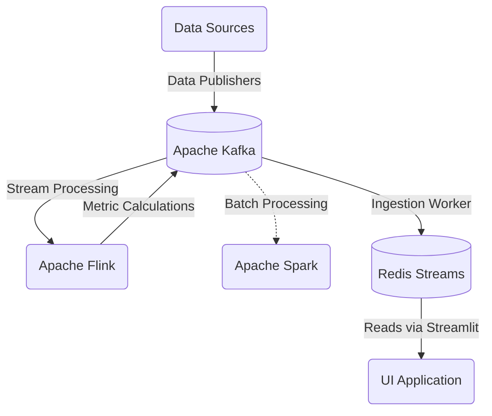

# Opus

Opus is a real-time market data streaming platform composed of modular data pipelines that ingest both live and historical ticker data. The system serializes data using Confluent Avro with Kafka Schema Registry and processes it using Apache Flink (PyFlink 2.2.0) to generate actionable financial metrics such as tumbling-window OHLC candlesticks and exponential moving averages (EMA).

Its modular architecture enables seamless integration with widely used data processing and storage systems, including Apache Spark (PySpark 4.0.2) for batch analytics and Redis for real-time data serving.

---

## 1. Project Overview

This project implements a real-time financial data processing pipeline that simulates live market data streaming and visualizes technical indicators on an interactive dashboard. The system replays historical stock market data as a simulated live stream and processes it using a distributed streaming architecture built on *Apache Kafka* and *Apache Flink*. Market data is ingested into Kafka, processed by a Flink streaming job to compute technical indicators such as **OHLC** (Open, High, Low, Close) and **EMA** (Exponential Moving Average), and then stored in Redis for fast retrieval by a Streamlit dashboard.

The main goal of the project is to demonstrate how modern data engineering tools can be combined to build a scalable real-time analytics pipeline. The system architecture simulates the data flow of real-world trading platforms, where market data streams are continuously processed and visualized for monitoring and analysis.

Key features include:

- Real-time streaming simulation using historical market data
- Distributed event streaming using Apache Kafka
- Stream processing and technical indicator calculation using Apache Flink
- Fast in-memory storage using Redis
- Interactive visualization through a Streamlit dashboard
                       
---

## 2. Architecture


```mermaid
flowchart TD
    A(Data Sources) -->|Data Publishers| B[(Apache Kafka)]
    B -->|Stream Processing| C(Apache Flink)
    B -.->|Batch Processing| F(Apache Spark)
    B -->|Ingestion Worker| D[(Redis Streams)]
    C -->|Metric Calculations| B
    D -->|Reads via Streamlit| E(UI Application)
```

The system follows an event-driven data pipeline centered around Apache Kafka. Historical market data is first read from local data sources and published into Kafka by a market data publisher. Kafka serves as the central message bus of the system, decoupling data producers from downstream processing and allowing multiple components to consume the same stream independently.

From Kafka, the pipeline branches into multiple processing paths.

On the streaming side, Apache Flink consumes live market events from Kafka and performs real-time metric calculations, such as OHLC aggregation and EMA computation. The processed results can then be sent back into Kafka as derived metrics, enabling continuous stream-based analytics.

On the batch side, Apache Spark can consume data from Kafka for larger-scale or offline batch processing tasks. This path is separated from the streaming worlflow because it is intended for historical analysis and non-real-time computation.

A separate ingestion worker consumes processed data from Kafka and writes it into Redis Streams. Redis acts as a fast in-memory serving layer, making the latest processed market data available with low latency.

Finally, the UI application, built with Streamlit, reads data from Redis Streams and renders the real-time dashboard. This design keeps the dashboard lightweight and responsive, since it does not need to query Kafka or perform heavy computations directly.

Overall, the architecture separates data ingestion, processing, storage, and visualization into distinct components. This modular design improves model scalability, maintainability, and flexibility, while also reflecting the structure of real-world streaming analytics systems.

---

## 3. Component Analysis

The system is organized into several components, each responsible for a different stage of the data pipeline. These modules work together to simulate a real-time financial data processing architecture.

### 1. Market Module (`src/opus/market/`)

This module is responsible for data ingestion and publishing. It reads historical market data stored in CSV files and converts them into structured events.

The module performs the following tasks:

- Parses historical CSV market data
- Serializes events using **Confluent Avro**
- Registers schemas through the **Kafka Schema Registry**
- Publishes events to **Appache Kafka topics**
- Supports **variable playback speeds** to simulate real-time streaming
- Maintains accurate timestamp synchronization when replaying historical data
  
This component acts as the **data producer** in the pipeline.

### 2. Process Module (`src/opus/process/`): 
This module handles data processing and analytics. It contains both **real-time** and **batch processing pipelines**.

- **Stream Processing (`stream/`)**:
   
  The streaming pipeline uses **Apache Flink** to process market events in real time.
      
  Flink continuously consumes raw market data from Kafka and calculates financial indicators such as:

  - **OHLC candlesticks** using tumbling time windows
  - **Exponential Moving Average (EMA)**
  - Other derived market metrics

  Because Flink processes events continuously, the system can update financial indicators as new data arrives.
  
- **Batch Processing (`batch/`)**:
    
  The batch pipeline uses **Apache Spark** to perform periodic large-scale computations on historical market data.

  This layer is designed for tasks such as:
  - Historical data analysis
  - Feature engineering
  - Machine learning and predictive modeling
  - Offline financial analytics

  Batch processing complements the streaming pipeline by enabling deeper analysis without requiring real-time execution.

### 3. Ingest Module (`src/opus/ingest/`): 
This module bridges the processing layer and the visualization layer.

The `redis_worker.py` component performs the following tasks:
- Consumes processed metric events from Kafka topics
- Writes the latest computed results into **Redis Streams**
- Uses the Redis `xadd` command to append new entries efficiently

### 4. UI Module (`src/opus/ui/`): 
This module provides an interactive dashboard for visualizing market data. It is implemented using **Streamlit** and connects directly to Redis to retrieve the latest processed data.

The dashboard displays:
- Candlestick charts
- EMA indicators
- Trading volume
- Live streaming updates
    
By reading from Redis rather than Kafka, the UI remains lightweight and responsive while continuously reflecting updates from the streaming pipelines.

---

## 4. Environment Setup

This project requires several system dependencies to support distributed streaming, processing, and visualization components.

### 1.System Requirements

Ensure the following tools are installed on your machine:
  
- **Docker & Docker Compose**: For running Kafka, Kafka Schema Registry, Flink, Redis, and Spark.
- **Python 3.10+**
- **Java 17**: Required for Flink and Spark
- **uv**: Python package manager

### 2. Verify Installation

Run the following commands to verify that all required tools are correctly installed:

```bash
docker --version
docker compose version
python3 --version
java -version
uv --version
```

Expected outputs should display version numbers for each tool.

### 3. Clone or Download the Repository

If using Git:

```bash
git https://github.com/edwardyliu-uoft/opus.git
cd <repository-name>
```
Replace `repository-url` with the actual GitHub repository link.

If you download the project as a ZIP file, extract it and navigate into the project directory:

```bash
cd <path-to-project-folder>
```

### 4. Install Python Dependencies

Install all required Python packages using `uv`:

```bash
uv sync
```

This command installs all dependencies defined in `pyproject.toml` and ensures a reproducible environment. Once the environment is set up, proceed to the next section to run the full pipeline.

---

## 5. How to Run 

### macOS Version

This project runs as a local multi-process pipeline. On macOS, it is recommended to use the built-in **Terminal** and run each component in a separate terminal window or tab. 

This pipeline requires 4 terminal windows running simultaneously:
1. Market data publisher
2. Flink stream processing
3. Redis ingest worker
4. UI dashboard

*Note: All commands should be executed from the project root directory unless otherwise specified. Do not close any of these processes while testing the system.*


### Step 1: Start the Infrastructure

Open Terminal in the project root and run:

```bash
docker compose up -d
```

### Step 2: Verify Containers

Check that all containers are running:

```bash
docker ps
```

Ensure the following services are running:
- Kafka
- Schema-registry
- Redis
- Jobmanager/ Taskmanager (Flink)
- Spark-master/ Spark-worker

### Step 3: Publish Market Data

Open a new terminal window and run:

```bash
uv run opus market publish <TICKER> --start <START_DATE> --end <END_DATE> --speed <MULTIPLIER>
```

Example:

```bash
uv run opus market publish AAPL --start 20181101 --end 20181105 --speed 50
```

In this example:
- `AAPL` is the ticker symbol
- `20181102` is the replay date
- `--speed 50` means the historical data is replayed 50 times faster than real time

This command replays historical market data as a simulated live stream into Kafka.

*Note: You can adjust the speed multiplier to playback the historical data faster or slower than real-time.*

### Step 4: Start the Flink Stream Processing Job

Open another new terminal window and run:

```bash
uv run opus process stream --create-topics
```

This starts the Flink job that consumes market events from Kafka and computes the downstream financial metrics.

Expected behavior:
- Logs appear in the terminal
- The process continues running

*Note: Flink jobs hang indefinitely by design. You will see PyFlink startup noise, but the terminal will appear "stuck" while it perpetually evaluates new records.*

### Step 5: Start the Regis Ingestion Worker

Open another terminal window and run:

```bash
uv run opus ingest redis
```

This ingestion worker reads data from Kafka and inserts it into Redis Streams to ensure that newly processed metrics are propagated downstream properly.

Expected behavior:
- Logs appear in the terminal
- The process continues running

### Step 6: Launch the Live Dashboard

Open another terminal window and run:

```bash
uv run opus ui app
```

Expected Result:

If the pipeline runs successfully:
- The dashboard displays 5-minute OHLC candlesticks charts
- EMA indicators (e.g., EMA(9), EMA(12)) are overlaid on the chart
- Trading volume
- The chart updates continuously as new data flows through the pipeline

### Important Notes:

- If the dashboard does not update, ensure the market publisher is still running
- Increasing `--speed` will make updates appear faster
- The dashboard only shows the most recent N candles, so it may appear as if only a small portion of data is displayed

---

### Windows Version

This project runs as a local multi-process pipeline. On Windows, it is recommended to use **PowerShell** and start each long-running component in a separate terminal.

### Step 1: Start the Infrastructure

Open PowerShell in the project root and run:

```bash
docker compose up -d
```

### Step 2: Confirm containers are running

In each new PowerShell window, first navigate to the project directory and activate the virtual environment:

```bash
cd your path
.\.venv\Scripts\activate
```
Once activated, the terminal prompt should show (opus).

### Step 3: Publish Market Data
```bash
python -m opus.cli opus market publish <TICKER> --start <START_DATE> --end <END_DATE> --speed <MULTIPLIER>
```
Example
```bash
python -m opus.cli opus market publish AAPL --start 20181101 --end 20181105 --speed 50
```
This command replays local historical market data into Kafka as simulated real-time events.

In this example:
- `AAPL` is the ticker symbol
- `20181102` is the replay date
- `--speed 50` means the historical data is replayed 50 times faster than real time

*Note: You can adjust the speed multiplier to playback the historical data faster or slower than real-time.*

### Step 4: Start the Flink Stream Processing Job

Open a new PowerShell window and run:
```bash
python -m opus.cli process stream --create-topics
```

This starts the Flink job that consumes market events from Kafka and computes the downstream financial metrics.

Expected behavior:
- Logs appear in the terminal
- The process continues running

*Note: Flink jobs hang indefinitely by design. You will see PyFlink startup noise, but the terminal will appear "stuck" while it perpetually evaluates new records.*

### Step 5: Start the Redis Ingestion Worker

Open a new PowerShell window and run:
```bash
python -m opus.cli ingest redis
```
This worker consumes processed Kafka topics and writes the results into Redis.

Expected behavior:
- Logs appear in the terminal
- The process continues running

### Step 6: Launch the Live Dashboard
```bash
python -m opus.cli ui app
```

Expected result:

If the pipeline runs successfully:
- The dashboard displays 5-minute OHLC candlesticks charts
- EMA indicators (e.g., EMA(9), EMA(12)) are overlaid on the chart
- Trading volume
- The chart updates continuously as new data flows through the pipeline

### Important Notes:

- If the dashboard does not update, ensure the market publisher is still running
- Increasing `--speed` will make updates appear faster
- The dashboard only shows the most recent N candles, so it may appear as if only a small portion of data is displayed

---

## 6. Data Source

The dataset used in this project consists of historical high-frequency trade data for 58 publicly traded companies (e.g., Apple, Amazon, Tesla). The data was originally purchased from Algoseek, a financial data provider specializing in institutional-grade historical market data.

Algoseek provides detailed market microstructure data, including trades, quotes, and order book information derived from U.S. equity exchanges. In this project, we use tick-level trade data, where each row represents an individual trade transaction recorded in the market. All datasets share the same schema and structure across different stocks.

Due to the large size of high-frequency market data, this repository includes a subset of the original dataset covering 8 trading days for demonstration and testing purposes.

The data is stored in compressed `.csv.gz` format, with each file corresponding to a single stock (e.g., `AAPL.csv.gz`). Each file includes the following fields:

| Field | Description |
|------|-------------|
| Date | Trading date in YYYYMMDD format |
| Timestamp | High-precision timestamp of the trade event |
| EventType | Type of market event (e.g., TRADE) |
| Ticker | Stock ticker symbol |
| Price | Trade execution price |
| Quantity | Number of shares traded |
| Exchange | Exchange where the trade occurred |
| Conditions | Exchange-specific trade condition codes |

These fields allow the reconstruction of market activity at a very fine temporal resolution and are commonly used in quantitative finance research, algorithmic trading, and market microstructure analysis.

---

## 7. Using Other Data 

The current demo uses a local subset of historical U.S. equities market data and replays it into Kafka as simulated real-time events. However, the pipeline is not limited to the bundled sample files. It can be adapted to other datasets as long as the input records are converted into the format expected by the stream processing job.

### Using Another Historical Equity Dataset

For trade-event style market data, the easiest approach is to keep the downstream pipeline unchanged and only replace the input data source. In practice, this means mapping the new dataset into the same market event structure used by the publisher and publishing the transformed records to the `market` Kafka topic.

At minimum, the input should provide fields equivalent to:

- `Date`
- `Timestamp`
- `EventType`
- `Ticker`
- `Price`
- `Quantity`
- `Exchange`
- `Conditions`

If the new data can be transformed into this schema, the existing Flink job, Redis worker, and Streamlit dashboard can continue to work without major changes.

### Using a Different Ticker

Any ticker present in the local dataset can be replayed by changing the publish command. For example:

```bush
python -m opus.cli market publish MSFT --start 20181102 --end 20181102 --speed 50
``` 

### Using Real-time Market Data

To support real-time data, the historical publisher can be replaced with a live data publisher that continuously ingests events from an external market API, maps them to the existing `market_events` schema, and publishes them to the Kafka `market` topic. Once the events enter Kafka in the expected format, the existing Flink, Redis, and Streamlit pipeline can continue to run without major downstream changes.

---

## 8. Trouble Shooting
### Java Version Issues

This project should be run with **JDK 17**. If another version is active, the Flink stream job may start but fail during execution. To verify the active Java version, run:

```bush
java -version
javac -version
```

### Project Path
The project should preferably be placed in a path without spaces. In local Windows environments, PyFlink and JVM-based components may fail to load local JAR dependencies correctly when the project directory contains spaces.

### `market` Publisher Finishes Immediately But No Data Appears

If the publisher completes without errors but no data appears in Kafka, Redis, or the dashboard, the most likely cause is that the selected date does not exist in the local data directory.

### `uv` Command is Not Recognized in Windows
The project exposes an `opus` CLI entrypoint and can also be run through `uv`. However, in some Windows environments, `uv` may not be available directly from the terminal even if the environment has been created successfully. This README uses `python -m opus.cli ...` because it was the most reliable approach in the local Windows excution.

---

## 9. Next Steps

Possible future extensions of the project include:

- Integrating a news API stream into the dashboard so that market data and related news events can be viewed together in real time.
- Adding real-time analysis feedback that connects news events with short-term price movements, allowing the dashboard to highlight unusual patterns and explain market behavior as new data arrives
- Extending the pipeline with predictive models for future candlestick estimation.
- The current implementation of the EMA is an approximation based on a simplified streaming algorithm. It does not fully match the standard financial EMA calculation. We plan to refine the implementation to align with the conventional EMA definition used in quantitative finance.
- Supporting multiple tickers in the dashboard so that users can compare price behavior and technical indicators across different stocks.
- Adding alert functions for rapid price changes, unusual volume spikes, or indicator crossovers.
- Improving the dashboard with richer interaction features such as ticker filters, time-range controls, and metric selection.